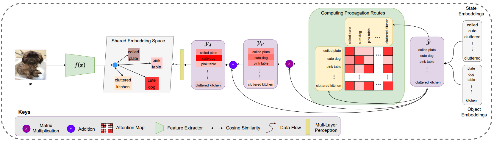

# Compositional Zero-Shot Learning
This is the official PyTorch code of the CVPR 2021 works [Learning Attention Propagation for Compositional Zero-Shot Learning](https://arxiv.org/abs/2210.11557). This repository extends [CGE](https://github.com/ExplainableML/czsl) repository and provides code for CAPE. For previous methods, please use the original [CGE](https://github.com/ExplainableML/czsl) repository.


<p align="center">
  
</p>

## Setup 

1. Clone the repo 

2. For Conda please run:
```
    conda env create --file environment.yml
    conda activate czsl
```
   For pip you can use
```
    pip install -r requirements.txt
```

4. Go to the cloned repo and open a terminal. Download the datasets and embeddings, specifying the desired path (e.g. `DATA_ROOT` in the example):
```
    bash ./utils/download_data.sh DATA_ROOT
    mkdir logs
```
For details on how to download data or any problems related to it please visit [this](https://github.com/ExplainableML/czsl). 


## Training
**Closed World.** To train a model, the command is simply:
```
    python train.py --config CONFIG_FILE
```
where `CONFIG_FILE` is the path to the configuration file of the model. 
The folder `configs` contains configuration files for all methods, i.e. CGE in `configs/cge`, CompCos in `configs/compcos`, and the other methods in `configs/baselines`.  

To run CAPE on CGQA use the following command:
```
    python train.py --config configs/config_sota/cgqa_encoder.yml
```
Model file is in models/CAPE.py. models/CAPE_ablation.py contains code for all ablations.

**Note:** To create a new config, all the available arguments are indicated in `flags.py`. 

## Test
 

To test a model, the code is simple:
```
    python test.py --logpath LOG_DIR
```
where `LOG_DIR` is the directory containing the logs of a model.


## References
If you use this code, please cite
```
@inproceedings{khan2023learning,
  title={Learning Attention Propagation for Compositional Zero-Shot Learning},
  author={Khan, Muhammad Gul Zain Ali and Naeem, Muhammad Ferjad and Van Gool, Luc and Pagani, Alain and Stricker, Didier and Afzal, Muhammad Zeshan},
  booktitle={Proceedings of the IEEE/CVF Winter Conference on Applications of Computer Vision},
  pages={3828--3837},
  year={2023}
}
```
```
@inproceedings{naeem2021learning,
  title={Learning Graph Embeddings for Compositional Zero-shot Learning},
  author={Naeem, MF and Xian, Y and Tombari, F and Akata, Zeynep},
  booktitle={34th IEEE Conference on Computer Vision and Pattern Recognition},
  year={2021},
  organization={IEEE}
}
```
and
```
@inproceedings{mancini2021open,
  title={Open World Compositional Zero-Shot Learning},
  author={Mancini, M and Naeem, MF and Xian, Y and Akata, Zeynep},
  booktitle={34th IEEE Conference on Computer Vision and Pattern Recognition},
  year={2021},
  organization={IEEE}
}

```

**Note**: Some of the scripts are adapted from AttributeasOperators repository. GCN and GCNII implementations are imported from their respective repositories. If you find those parts useful, please consider citing:
```
@inproceedings{nagarajan2018attributes,
  title={Attributes as operators: factorizing unseen attribute-object compositions},
  author={Nagarajan, Tushar and Grauman, Kristen},
  booktitle={Proceedings of the European Conference on Computer Vision (ECCV)},
  pages={169--185},
  year={2018}
}
```
**Note**: Boilerplate code is taken from repository for Open World Compositional Zero-Shot Learning and Learning Graph Embeddings for Compositional Zero-shot Learning.

